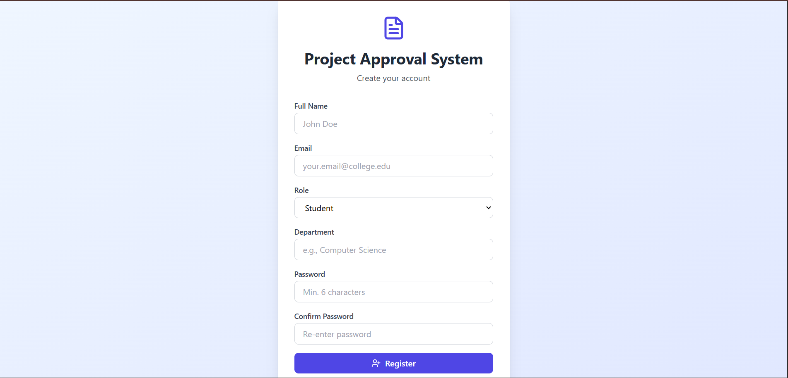
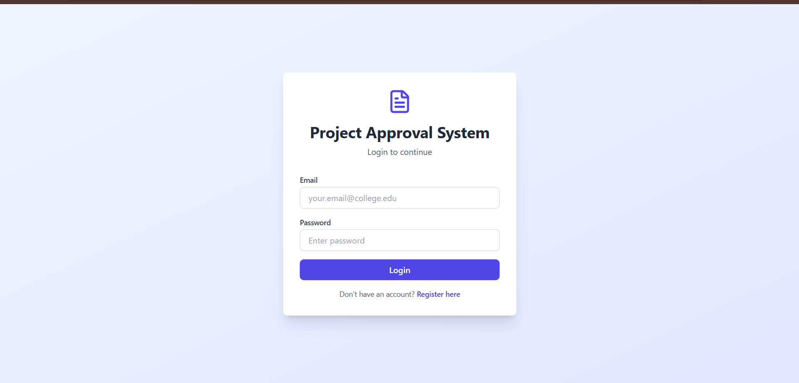
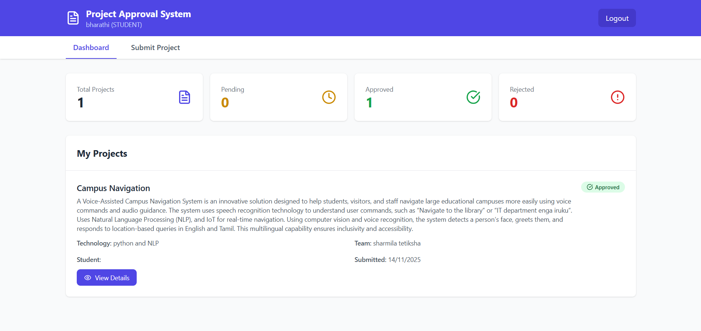
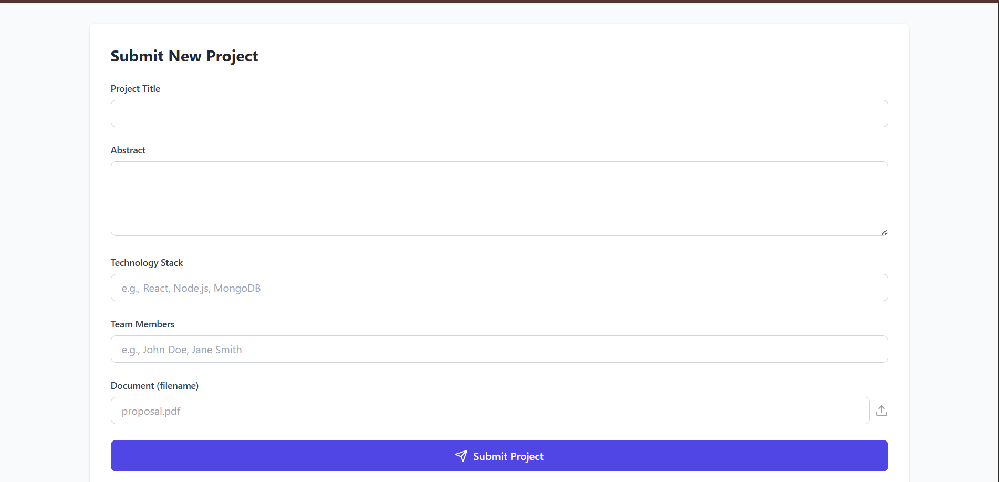
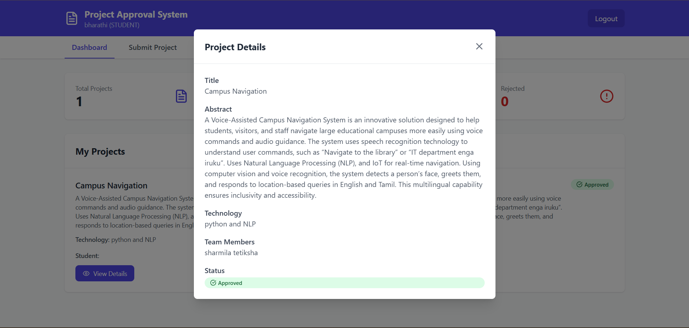
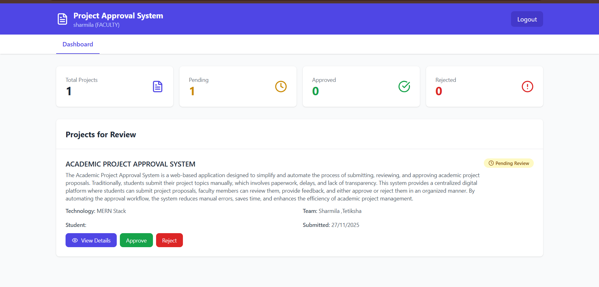
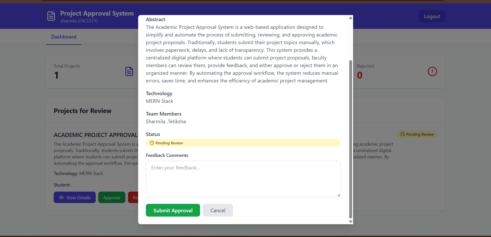
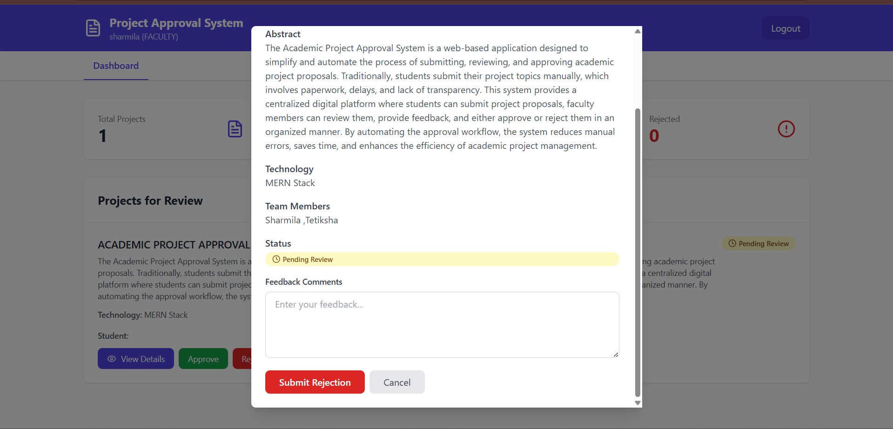

# Project-Approval-System-
Project Approval System is a web-based application that streamlines project submission and approval workflows. It enables users to submit projects and track status, while admins review, approve, or reject requests through a secure, role-based system.

## 📝 Registration Page

Purpose:
Allows new users (students/faculty) to create an account.

Key Features:

Full Name, Email, Role, Department

Password & Confirm Password validation

Role-based registration (Student / Faculty)

Clean UI with form validation

Why it’s important:
Ensures authenticated and role-based access to the system.

## 🔐 Login Page

Purpose:
Allows registered users to securely log in.

Key Features:

Email & password authentication

Redirects users based on role

Secure session handling

Link to registration page

Professional Value:
Shows authentication flow implementation.

## 📝 Student Dashboard

Purpose:
Gives students an overview of their project submissions.

Key Features:

Total projects count

Pending / Approved / Rejected status cards

Clean statistics layout

Navigation to submit new projects

Why it’s useful:
Students can track approval progress in real time.

## 📝 Submit New Project Page

Purpose:
Allows students to submit project proposals.

Key Fields:

Project Title

Abstract (detailed description)

Technology Stack

Team Members

Document upload (proposal PDF)

Professional Touch:
Mimics real academic/industry project submission systems.

## 📝 Student – My Projects List 
Purpose:
Displays all projects submitted by the student.

Key Features:

Project title & description preview

Technology stack & team members

Submission date

Status badge (Approved / Rejected / Pending)

“View Details” button

## 📝  Project Details Modal (Student View)

Purpose:
Shows complete project information.

Includes:

Full abstract

Technology stack

Team members

Current approval status

Read-only view for students

Why it’s important:
Ensures transparency in evaluation.

## 📝Faculty Dashboard 
Purpose:
Allows faculty to review student projects.

Key Features:

Projects pending review

Approve / Reject buttons

Status indicators

Faculty role-based access

Industry Relevance:
Implements reviewer workflow.

 
## 📝Faculty – Project Review Modal

Purpose:
Faculty evaluates submitted projects.

Key Actions:

Read full abstract

View technology stack

Add feedback comments

Approve or Reject project

Professional Feature:
Feedback-driven approval system.

## 📝 Admin Dashboard

Purpose:
Provides complete system-level overview.

Key Metrics:

Total projects

Approved / Pending / Rejected count

All project listings

Admin-only access

Why recruiters like this:
Shows admin-level control and analytics.

🔟 Admin – All Projects View

Purpose:
Admin can monitor every project in the system.

Features:

View all projects across users

Status tracking

Read-only admin oversight

Clean layout with scalability
